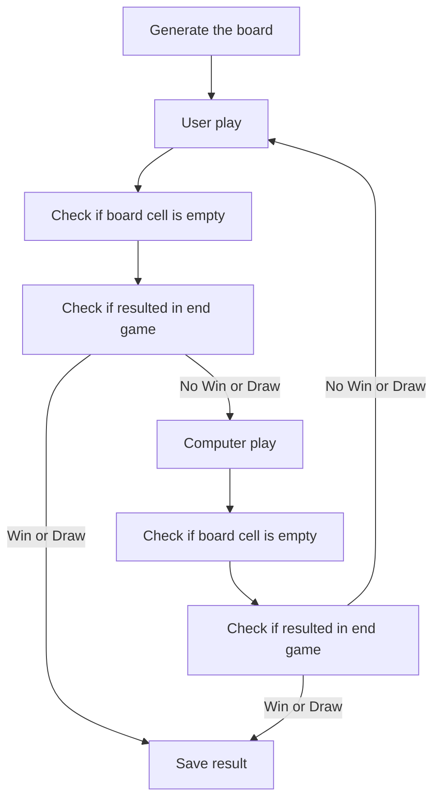

# Tic-Tac-Toe Project

This Python project implements a simple console Tic-Tac-Toe (Hash Game) where a user plays agaist a computer making random moves. The game tracks wins and draws, saving the results to a text file.

## Objectives

To construct the game, I implemented a system were:
- The user plays against a computer.
- The computer plays are random.
- At the end of the game, save the result and the name of the winner.

## Project Structure

The logic to construct the program was:



### Code

The code is organized into functions for clarity and reusability:

- `generateBoard()`: Creates the initial empty 3x3 game board.
- `writeBoard(board)`: Displays the current state of the board in the console.
- `moveComputer(board)`: Handles the computer's random move.
- `valid(value)`: Checks if a row or column index is valid (0-2).
- `moveUser(board)`: Prompts the user for their move and validates input.
- `verifyWinnerInRow(board, character)`: Checks for a win in any row.
- `verifyWinnerInColumn(board, character)`: Checks for a win in any column.
- `verifyWinnerInDiagonal(board, character)`: Checks for a win on both the diagonals.
- `verifyWinner(board, character)`: Combines win checking logic.
- `hash()`: Main game loop - handles player turns, win checks, and displays the result.
- `recordWinner(nameWinner, file)`: Appends the winner's name or draw to `results.txt`.
- `readFileWinners(file)`: Reads and returns a list of previous winners from the file.
- `writeList(list)`: Displays the list of previous winners.
- `main()`: Presents the main menu and handles user interaction.


## How to Play

1. Run the script:
```bash
python main.py
```

2. Choose from the menu:
    - Play a new game.
    - View previous results.
    - Exit the game.

3. On the game:
    - The board is displayed with numbered rows and columns.
    - Enter the row and column number to place your move.
    - The computer will automatically make its move.

## Example of the Program Running

```python
----MENU----

1 - Play
2 - See previous winners
0 - Leave game

Enter the option:
1

-------------Hash Game-------------
                0       1       2
         0      #       #       #
         1      #       #       #
         2      #       #       #

        Inform the row:1
        Inform the column:1


-------------Hash Game-------------
                0       1       2
         0      O       #       #
         1      #       X       #
         2      #       #       #

        Inform the row:0
        Inform the column:2


-------------Hash Game-------------
                0       1       2
         0      O       #       X
         1      #       X       #
         2      X       O       #

        The user won!
        Inform your name:Victor


----MENU----

1 - Play
2 - See previous winners
0 - Leave game

Enter the option:
2

Winners:
computer
Victor
draw
Victor


----MENU----

1 - Play
2 - See previous winners
0 - Leave game

Enter the option:
0
End of program
```
